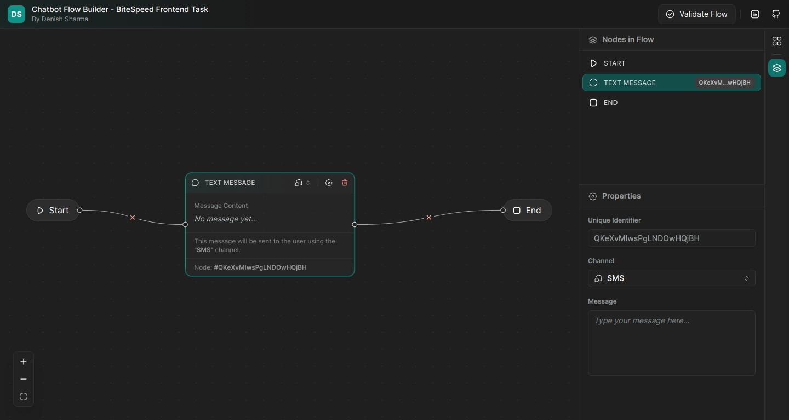

# BiteSpeed Frontend Task: Chatbot flow builder

[See the live demo](https://chatbot-flow-builder-task-bitespeed.vercel.app/)

We’ll build a simple Chatbot flow builder using React and try to make the code extensible to easily add new features.

A chatbot flow is built by connecting multiple messages to decide the order of execution.

## Features

### Nodes

- **Start Node**: The starting point of the flow.
- **Message Node**: A message to be displayed to the user.
- **Conditional Path Node**: A condition to be matched with multiple cases or paths to be taken. (showcase to use of dynamic handles)
- **End Node**: The end of the flow.

### Sidebars

- **Node Sidebar**: Contains the list of nodes that can be added to the flow.
- **Node Properties Sidebar**: Contains the properties of the selected node.

### Flow

- **Validation**: Check if the flow is valid or not. A valid flow should have a start node and an end node.
- **Auto Adjust**: Nodes will automatically adjust their position to avoid overlapping. It won't adjust the flow lines.

## Tech Stack & Libraries

- React
- React Flow
- Zustand
- TypeScript
- UnoCss

## Author

- **Denish Sharma**
    - Email: denishcommon@gmail.com
    - LinkedIn: [denish-sharma](https://www.linkedin.com/in/denishsharma/)
    - GitHub: [denish-sharma](https://www.github.com/denishsharma)
    - React Starter Template: [react-starter-template](https://github.com/denishsharma/react-starter-template)
